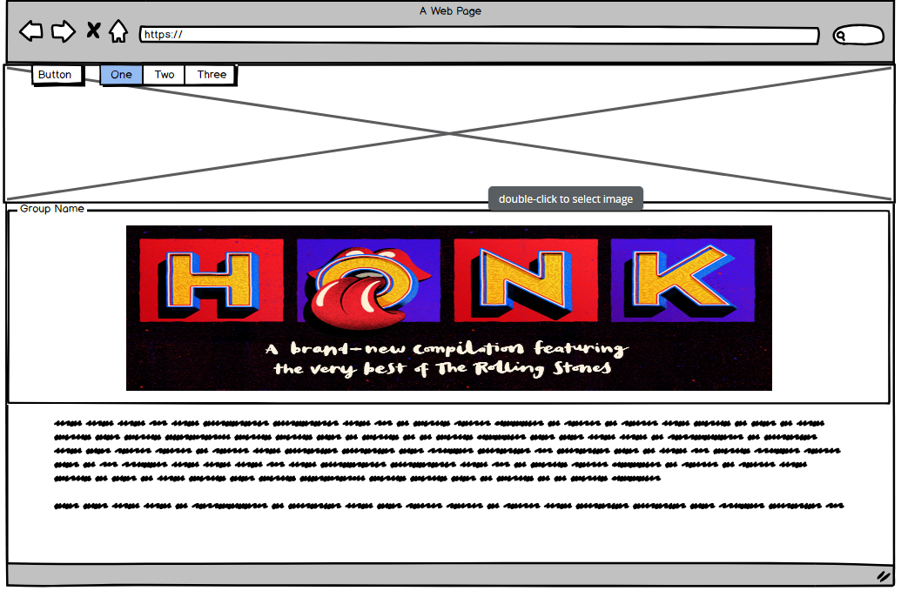
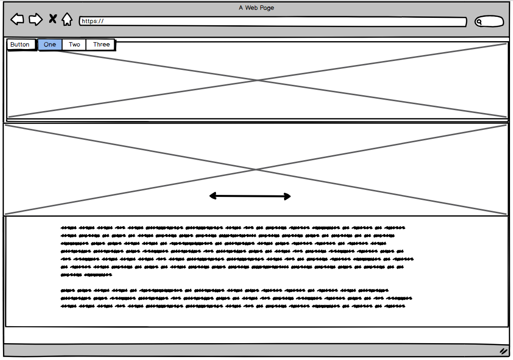
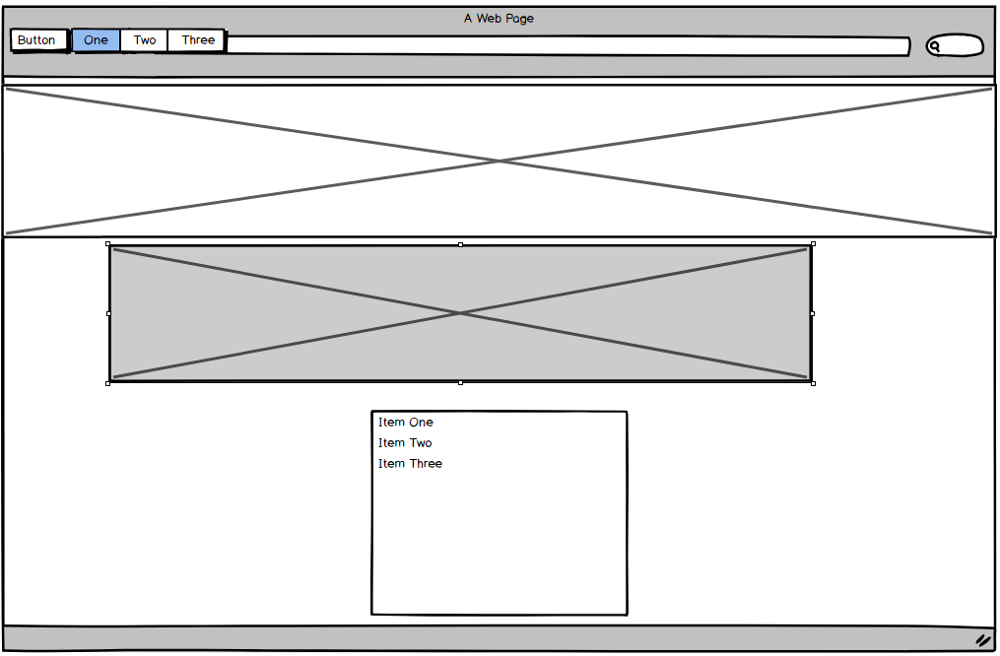
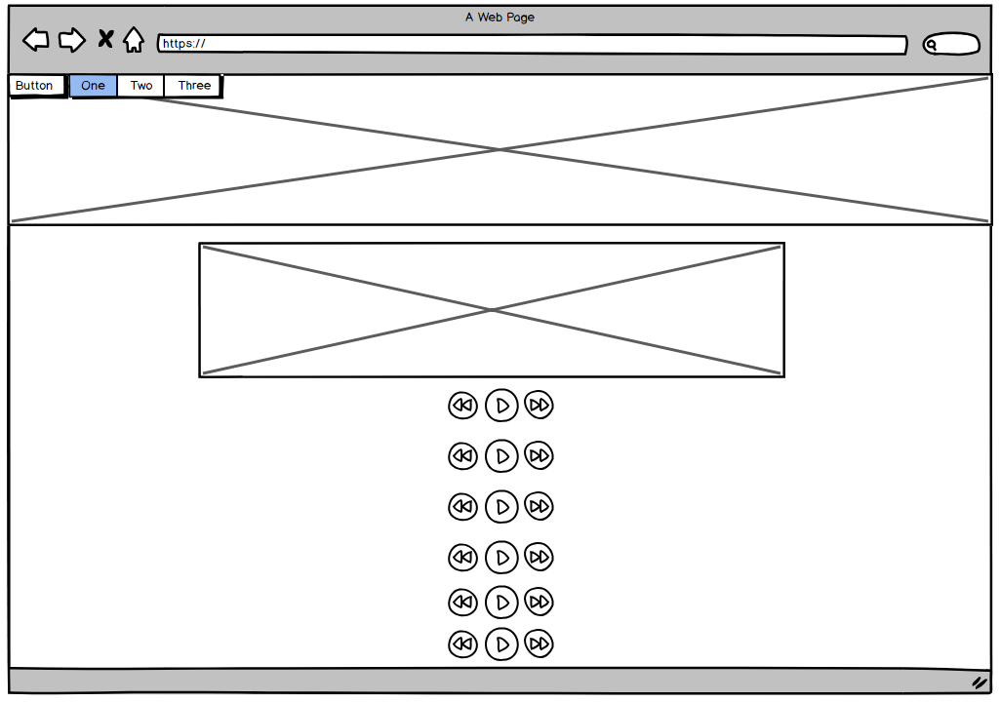
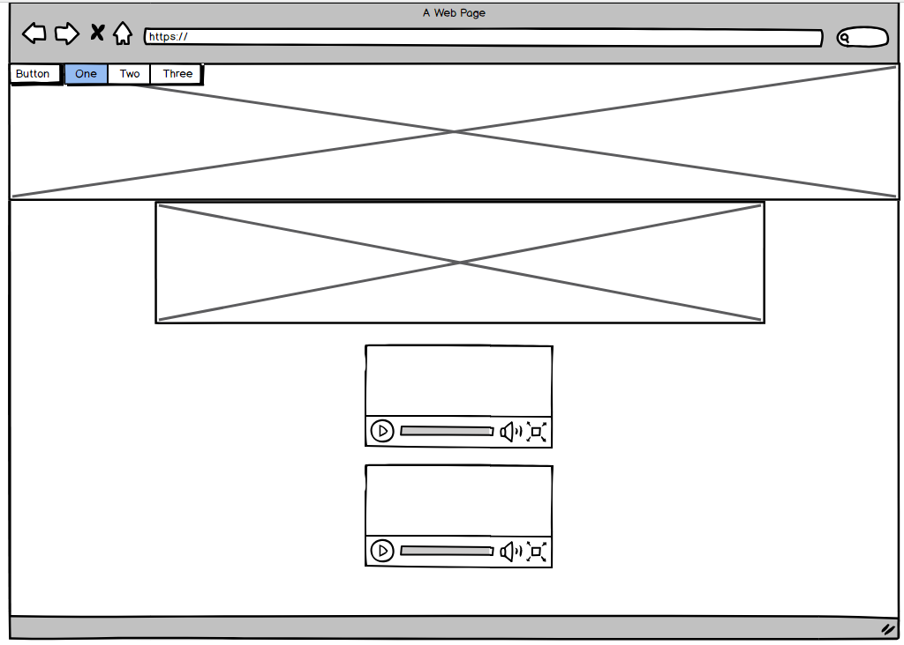

## Patrick Kelly The Rolling Stones Band Website project

This is my project on the band the Rolling Stones. The projects aim was to show some history of the site and allow fans to enjoy some songs. I decided to go with this band, as I'm a huge fan.

##Demo
A live demo can be found at https://paddy-ie.github.io/First-Milestone-project-TheRollingStones/

## UX
My goal in the design was to make information accessible on the site, while striving for a minimalist I feel the picture in the background adds a uniqueness of the site. The aim of the site is to both give the use a bit of history of the band, also to allow them appreciate some of this bands great music. I went with a slide effect on all pages and on the about section added in a full page slider.

##Technologies
* HTML
* CSS
* Bootstrap

## Wireframes

This is roughly how I wanted the sites to look.

index.html

about.html

tour.html       This links out to the Booking website, so actual tickets can be bought

listen.html       A list of songs can be played in the site.

watch.html          Youtube videos are embedded

## Features:
This site uses a full width slider, and the site is based on a scroll design 

## Testing:
This site was manually tested to ensure compatibility and responsiveness. My wife also helped out and took the site for a spin. 

## Deployment:
The live site is deployed on GitHub pages. It uses the master branch. It updates each time there is a new push to the repository.

## Credits:
https://codepen.io/JacobLett/full/PjKLgK/ This was used to make the Carousel on the About us page.

## Content:
History of the band and band member Bio's were all taken from Wikipedia

## Bugs:
At first I didn't have the Navbar fixed in place. So I tried making it sticky (Changing  position: sticky;), this caused a line in the background which proved to be very distracting. I changed the position of the container to: Changing  position: fixed; which solved the issue.
I'm still gettingto gribs with CSS, so this site has taken me longer, but with everything,  experience will make it easier and quicker.

## Media:
All photos are from Google Image search  and Audio is from Youtube

## Acknowledgements:

The site is modeled on some exmaple sites I completed, but has been heavly modified.

All Images and video/Audio are subject to copyright of their respective owners

This is for educational use only.
